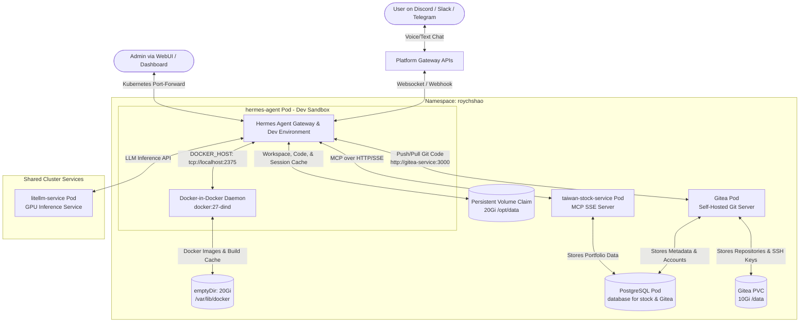

# Hermes Agent Kubernetes Deployment

This repository contains the Kubernetes configuration files, container definitions, and custom build-time patches for deploying [Hermes Agent](https://github.com/NousResearch/Hermes-Agent). It provides an autonomous software engineering sandbox, self-healing architecture, and extensible tool integration on Kubernetes.

---

## 📐 Cluster Architecture

The following diagram illustrates the network flow, service communication, and the multi-container development sandbox within the cluster.



---

## 🧰 AI Software Engineer Development Sandbox

The Hermes Agent container is configured as a full-featured remote Linux development sandbox, enabling the AI agent to develop, test, and package software autonomously:

* **Passwordless `sudo`**: Configured with `hermes ALL=(ALL) NOPASSWD:ALL`, allowing the agent to install system-level packages and C/C++ build dependencies (`sudo apt-get install ...`) on demand.
* **Pre-installed Toolchains**: Bundled with `build-essential`, `python3-dev`, `git`, `curl`, `wget`, `jq`, `docker.io`, and `docker-compose`.
* **Integrated Self-Hosted Git (Gitea)**: An internal lightweight Git server (`http://gitea-service:3000`) backed by PostgreSQL and 10Gi Longhorn persistence for Hermes Agent to push and manage code repositories.
* **Docker-in-Docker (DinD) Sidecar**: Runs `docker:27-dind` in privileged mode in the same Pod, exposing Docker over `tcp://localhost:2375`. This enables the agent to:
  * Build and tag Docker images (`docker build`).
  * Run multi-container integration tests & microservices (`docker compose up -d`).
  * Run code quality & coverage scans (e.g. SonarQube CLI & server).
* **High Resource Allocation**:
  * **Hermes Agent Container**: `requests: 2 CPU / 5Gi RAM`, `limits: 2.5 CPU / 7Gi RAM`
  * **DinD Daemon Container**: `requests: 2 CPU / 4Gi RAM`, `limits: 3.5 CPU / 7Gi RAM`
  * **Gitea Container**: `requests: 100m CPU / 256Mi RAM`, `limits: 500m CPU / 768Mi RAM`
  * **Storage**: **20Gi Longhorn PVC** for Hermes Agent + **10Gi Longhorn PVC** for Gitea + **20Gi emptyDir** for Docker cache.

---

## 📂 Repository Structure

```text
.
├── Dockerfile.hermes-agent      # Custom Dockerfile with dev tools, sudo, & Docker CLI
├── deploy.sh                    # One-click script to build, push, and deploy all services
├── open_dashboard.sh            # Port-forwarding helper for the Hermes Dashboard (Port: 9119)
├── open_webui.sh                # Port-forwarding helper for the Hermes WebUI (Port: 8787)
├── open_gitea.sh                # Port-forwarding helper for the Gitea Web UI (Port: 3000)
├── create_agent_users.sh        # CLI helper to batch create Gitea accounts for AI agents
├── patch_discord_status.py      # Patches 1 & 2: Discord presence status & typing indicator fixes
├── patch_voice_playback.py      # Patch 3: Voice channel audio routing fix
├── patch_voice_temp_paths.py    # Patch 4: Safe-write roots (/tmp path bypass) fix
├── subservices/                 # Extensible directory for custom code & tools
│   └── Taiwan-Stock-Service/    # Example sub-service (exposed as an MCP server)
└── k8s/                         # Kubernetes deployment resources
    ├── configmap.yaml           # Configs (LLM models, API endpoints, home directory)
    ├── deployment.yaml          # Multi-container Pod spec (hermes-agent + dind sidecar)
    ├── pvc.yaml                 # 20Gi Persistent Volume Claim for agent workspace & cache
    ├── gitea.yaml               # 10Gi PVC, Deployment, and Service for Gitea
    ├── rbac.yaml                # Service Account for agent permissions
    ├── service.yaml             # Service port declarations
    ├── postgres.yaml            # PostgreSQL database deployment
    └── taiwan-stock-service.yaml # Taiwan Stock Service deployment
```

---

## 🔌 Extending the Agent with Custom Code (`subservices/`)

If you want to add your own custom code, tools, or services to the agent, follow these steps:

1. **Add Code to `subservices/`**:
   Create a new sub-folder under the [`subservices/`](file:///home/royshao/hermes-agent/subservices) directory for your code (e.g., `subservices/my-custom-service`).

2. **Expose it as an MCP (Model Context Protocol) Server**:
   Write your service as an MCP server. The recommended approach is to expose it over **HTTP/SSE (Server-Sent Events)** using Python (e.g., `mcp-installer` or `fastapi-mcp`) or Node.js. 

3. **Deploy as a Separate Pod**:
   Create a Kubernetes deployment YAML for your service and deploy it in the cluster. This decouples your custom logic from the main agent pod and allows you to scale it independently.

4. **Register the Service in `deployment.yaml`**:
   Expose your new service via a Kubernetes `Service`. Then, update the `init-mcp-config` container inside [`k8s/deployment.yaml`](file:///home/royshao/hermes-agent/k8s/deployment.yaml) to automatically register your new endpoint in `/opt/data/config.yaml`:
   ```yaml
   mcp_servers:
     my-custom-service:
       url: "http://my-custom-service-svc:8000/sse"
       transport: sse
   ```
   Upon restart, the Hermes Agent will automatically discover the new tools and capabilities.

---

## 🛠️ Build-Time Patches & Customizations

Because the official upstream image `nousresearch/hermes-agent:latest` has minor bugs and lacks dev tools, we customize the container during the Docker build stage.

### 1. Developer Environment & Docker Toolchains ([`Dockerfile.hermes-agent`](file:///home/royshao/hermes-agent/Dockerfile.hermes-agent))
* Installs `sudo`, `curl`, `wget`, `git`, `jq`, `ca-certificates`, `build-essential`, and `python3-dev`.
* Installs `docker.io` and the official `docker-compose` CLI plugin.
* Grants passwordless `sudo` privileges to the `hermes` user.

### 2. Discord Presence & Typing Indicator ([`patch_discord_status.py`](file:///home/royshao/hermes-agent/patch_discord_status.py))
* **Presence:** Ensures the Bot status is displayed as "Online" when connected, rather than "Offline".
* **Typing Indicator Lock:** Fixes a bug where the bot appears to be permanently "typing" on Discord. We implement a **Generation Guard (generation ID)**. When the bot receives a new input or finishes sending a response, the generation ID increments, causing the previous typing loop tasks to instantly cancel and clean up.

### 3. Voice Channel Audio Playback ([`patch_voice_playback.py`](file:///home/royshao/hermes-agent/patch_voice_playback.py))
* **Issue:** When the agent runs a voice conversation and generates audio through `text_to_speech`, the gateway by default uploads it as an attachment to the Discord text channel instead of playing it in the voice channel.
* **Fix:** Patches [`patch_voice_playback.py`](file:///home/royshao/hermes-agent/patch_voice_playback.py) to route output audio through `play_tts` instead of `send_voice`. This plays the response directly inside the voice channel if the bot is currently connected to it, falling back to a text-channel upload if disconnected.

### 4. Safe-Write Path Access ([`patch_voice_temp_paths.py`](file:///home/royshao/hermes-agent/patch_voice_temp_paths.py))
* **Issue:** The Gateway's Auto-TTS system and live prompt chimes (`play_ack`) were hardcoded to write files to `/tmp/hermes_voice/`. Since the agent has a strict `HERMES_WRITE_SAFE_ROOT` security rule limiting file write operations to `/opt/data`, generating speech would fail with a `protected credential or system path` write denial error.
* **Fix:** Replaces `/tmp/hermes_voice` with the standard `DEFAULT_OUTPUT_DIR` resolved from the agent's home directory (resolves to `/opt/data/cache/audio/`). This allows file synthesis to succeed within the safe write roots.

---

## 🚀 Deployment Guide

Deploying the whole cluster is fully automated. Run the one-click deploy script:

```bash
chmod +x deploy.sh
./deploy.sh
```

The script will:
1. Build and push the custom `taiwan-stock-service` image.
2. Build the patched & dev-ready `hermes-agent` image using [`Dockerfile.hermes-agent`](file:///home/royshao/hermes-agent/Dockerfile.hermes-agent) and push it.
3. Clean up existing deployments in the namespace `roychshao`.
4. Apply the SealedSecrets, ConfigMap, PVC, PostgreSQL database, and all deployments in order.

---

## 🔒 Managing Secrets (Sealed Secrets)

To avoid storing plain-text API keys or passwords in Git, we use **Sealed Secrets**:

1. Write your plain-text secrets to `k8s/secrets/hermes-raw-secret.yaml` (this file is gitignored and will never be committed).
2. Run the sealing script:
   ```bash
   cd k8s/secrets
   ./seal_secrets.sh
   ```
3. This creates [`k8s/secrets/hermes-sealed-secret.yaml`](file:///home/royshao/hermes-agent/k8s/secrets/hermes-sealed-secret.yaml), which contains encrypted tokens safe to commit to your Git repository.

---

## 🎙️ How to Verify Discord Voice Mode

Once the pods are running and the bot is online on Discord:

1. Join a Discord Voice Channel.
2. Call the bot into the channel by typing:
   ```text
   /voice join
   ```
3. Talk to the bot or text it. The bot will synthesize the response and **play it directly inside the voice channel**.
4. To make the bot leave:
   ```text
   /voice leave
   ```

---

## 🔍 Useful Commands

* **Get Pod Status:**
  ```bash
  kubectl get pods -n roychshao
  ```
* **Verify Docker inside Hermes Agent:**
  ```bash
  # Check Docker Daemon connection
  kubectl exec -it deployment/hermes-agent -n roychshao -c hermes-agent -- docker info

  # Check Docker Compose version
  kubectl exec -it deployment/hermes-agent -n roychshao -c hermes-agent -- docker compose version
  ```
* **Check PVC Capacity:**
  ```bash
  kubectl get pvc hermes-agent-pvc -n roychshao
  ```
* **Follow Agent Container Logs:**
  ```bash
  kubectl logs -f deployment/hermes-agent -n roychshao -c hermes-agent
  ```
* **Follow Gateway Server Logs:**
  ```bash
  kubectl exec deployment/hermes-agent -n roychshao -c hermes-agent -- tail -f /opt/data/logs/gateway.log
  ```

