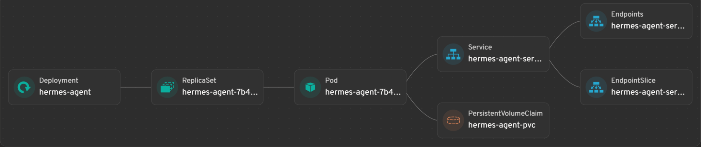

# Hermes Agent Kubernetes Deployment

This repository contains the Kubernetes configuration files for deploying [Hermes Agent](https://github.com/NousResearch/Hermes-Agent). Hermes Agent is a powerful AI agent system, and this deployment setup provides a secure and scalable architecture on Kubernetes.

## Architecture Overview

This deployment includes the following core components:
- **Hermes Agent**: The core service handling AI agent logic.
- **Tailscale Sidecar**: Used for secure networking and remote access.
- **Persistent Volume**: Ensures that agent states and workspace data are persisted.
- **Sealed Secrets**: Safely manages sensitive information like passwords and API keys within Git.

### System Architecture


## Repository Structure

```text
.
├── deploy.sh              # One-click deployment script
├── open_dashboard.sh      # Port-forwarding for the Dashboard
├── open_webui.sh          # Port-forwarding for the WebUI
├── images/
│   └── cluster_architechture.png
└── k8s/
    ├── configmap.yaml     # Environment variables and configurations
    ├── deployment.yaml    # Pod definitions (Hermes Agent & Tailscale sidecar)
    ├── pvc.yaml           # Persistent Volume Claim for data storage
    ├── rbac.yaml          # Role-Based Access Control for Tailscale
    ├── service.yaml       # Service definitions for internal/external access
    └── secrets/
        ├── hermes-sealed-secret.yaml # Encrypted secrets for K8s
        └── seal_secrets.sh           # Script to generate sealed secrets
```

## Prerequisites

Before you begin, ensure you have the following installed:
- `kubectl` configured to access your cluster.
- `kubeseal` (only if you need to update secrets).
- A running Kubernetes cluster.

## Getting Started

### 1. Manage Secrets
If you need to update your `HERMES_WEBUI_PASSWORD` or `TS_AUTHKEY`, create a `hermes-raw-secret.yaml` (do not commit this!) and run:

```bash
cd k8s/secrets
# Create your raw secret file, then:
./seal_secrets.sh
```

The script uses `kubeseal` to encrypt your secrets into `hermes-sealed-secret.yaml`, which is safe to commit.

### 2. Deploy to Kubernetes
You can deploy all components using the provided deployment script:

```bash
chmod +x deploy.sh
./deploy.sh
```

Alternatively, you can apply the files manually in order:

```bash
kubectl apply -f ./k8s/secrets/hermes-sealed-secret.yaml
kubectl apply -f ./k8s/rbac.yaml
kubectl apply -f ./k8s/configmap.yaml
kubectl apply -f ./k8s/pvc.yaml
kubectl apply -f ./k8s/deployment.yaml
kubectl apply -f ./k8s/service.yaml
```

### 3. Check Deployment Status
Monitor the status of your pods and services:

```bash
kubectl get pods -n roychshao
kubectl get svc -n roychshao
kubectl logs -f deployment/hermes-agent -n roychshao -c hermes-agent
```

## Accessing the Services

Since the services are deployed as `ClusterIP`, you can use the provided scripts to port-forward them to your local machine.

### Access WebUI (Default Port: 8787)
```bash
./open_webui.sh
```
Then open your browser and navigate to `http://localhost:8787`.

### Access Dashboard (Default Port: 9119)
```bash
./open_dashboard.sh
```
Then open your browser and navigate to `http://localhost:9119`.

## Configuration

Main configurations are defined in `k8s/configmap.yaml`:
- `ENVIRONMENT`: Deployment environment (e.g., production).
- `LOG_LEVEL`: Logging verbosity (e.g., info, debug).
- `HERMES_HOME`: Base directory for data storage within the pod.
- `HERMES_WEBUI_PORT`: Port for the WebUI service.

## Notes
- The default namespace is `roychshao`.
- The deployment uses the `nousresearch/hermes-agent:latest` image.
- Tailscale is used as a sidecar to provide secure access without exposing the connection port. In this repository configuration, it is mainly used for remote access to the web UI.
