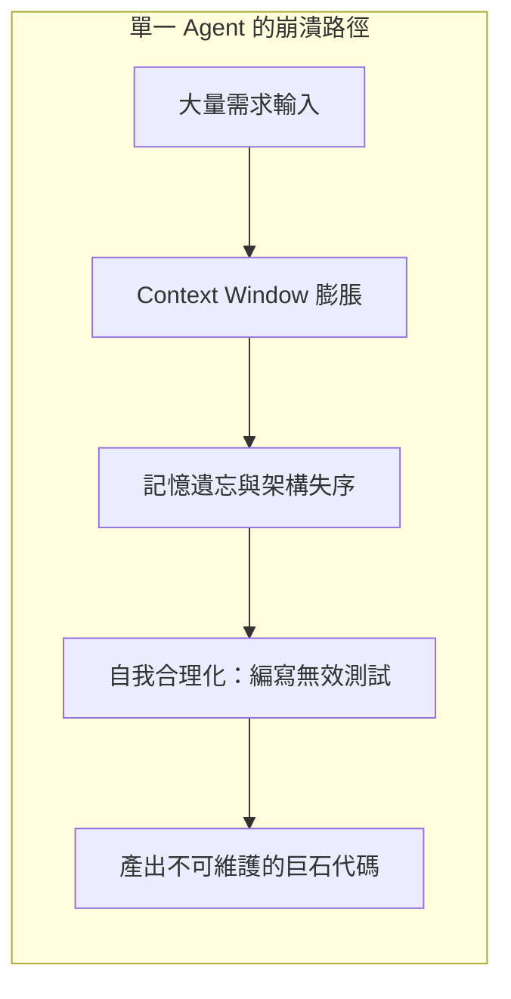
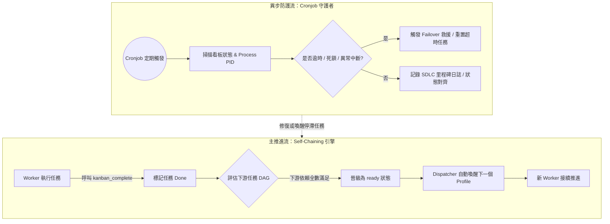
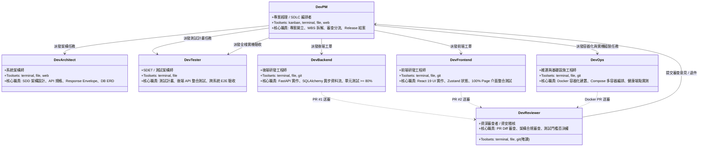
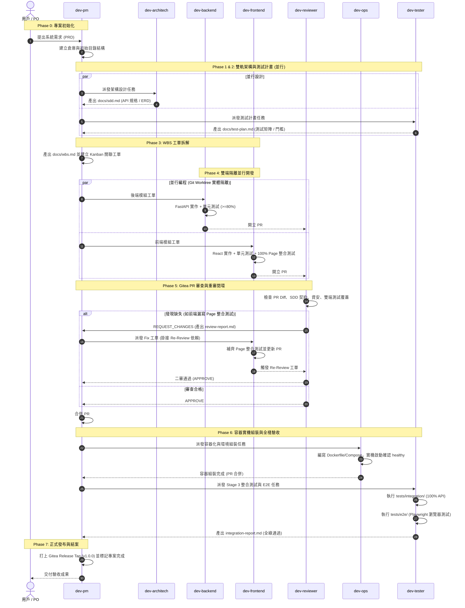

# 建立完全自主的 AI 研發團隊：基於 Hermes Agent 與 Kanban DAG 的高規格 SDLC 協同架構設計

> **架構設計與協作機制深度分享**  
> 本文系統性介紹如何基於 **Hermes Agent** 多角色輪廓（Multi-Profile）搭配 **Kanban 狀態機 (DAG)**，構建一支具備「角色明確分工、Self-Chaining 自鏈推進、Cronjob 心跳守護、PR-First 審查迴圈、雙端量化測試治理」的全自動化 AI 軟體工程團隊。

---

## 📑 目錄
1. [設計哲學：為何單一 Agent 無法勝任真實軟體開發？](#一設計哲學為何單一-agent-無法勝任真實軟體開發)
2. [協同核心引擎：為何需要 Self-Chaining 與 Cronjob 機制？](#二協同核心引擎為何需要-self-chaining-與-cronjob-機制)
   - [2.1 根本痛點：LLM 的無狀態性與「人工逐步戳動」瓶頸](#21-根本痛點llm-的無狀態性與人工逐步戳動瓶頸)
   - [2.2 Self-Chaining 機制：流水線自鏈自驅推進](#22-self-chaining-機制流水線自鏈自驅推進)
   - [2.3 Cronjob 守護機制：心跳、防死鎖與狀態對齊](#23-cronjob-守護機制心跳防死鎖與狀態對齊)
3. [七大角色光譜與嚴格責任邊界 (Role Spectrum & RACI)](#三七大角色光譜與嚴格責任邊界-role-spectrum--raci)
   - [3.1 各角色職能深度拆解 (含 dev-ops)](#31-各角色職能深度拆解-含-dev-ops)
   - [3.2 團隊 RACI 責任與工具授權矩陣](#32-團隊-raci-責任與工具授權矩陣)
4. [全生命週期協同流程 (End-to-End SDLC Lifecycle & DAG)](#四全生命週期協同流程-end-to-end-sdlc-lifecycle--dag)
   - [Phase 0: 專案初始化與組織設定](#phase-0-專案初始化與組織設定-dev-pm)
   - [Phase 1 & 2: 雙軌並行——系統架構與測試計畫](#phase-1--2-雙軌並行系統架構與測試計畫-dev-architech--dev-tester)
   - [Phase 3: WBS 工單拆解與相依綁定](#phase-3-wbs-工單拆解與相依綁定-dev-pm)
   - [Phase 4: 雙端並行隔離實作](#phase-4-雙端並行隔離實作-dev-backend--dev-frontend)
   - [Phase 5: Gitea PR-First 審查與修正閉環](#phase-5-gitea-pr-first-審查與修正閉環-dev-reviewer--dev-pm)
   - [Phase 6: 實機容器化建置與全棧驗收](#phase-6-實機容器化建置與全棧驗收-dev-ops--dev-tester)
   - [Phase 7: 正式發布與里程碑結案](#phase-7-正式發布與里程碑結案-dev-pm)
5. [前後端測試治理與責任歸屬深度拆解](#五前後端測試治理與責任歸屬深度拆解)
   - [5.1 語言與工具衝突的本質與隔離模型](#51-語言與工具衝突的本質與隔離模型)
   - [5.2 量化覆蓋率門檻與責任邊界判準](#52-量化覆蓋率門檻與責任邊界判準)
6. [產出文檔與工程交付物矩陣 (Artifacts & Deliverables)](#六產出文檔與工程交付物矩陣-artifacts--deliverables)
7. [結語：從「Prompt 工程」邁向「組織協同工程」](#七結語從-prompt-工程邁向組織協同工程)

---

## 一、設計哲學：為何單一 Agent 無法勝任真實軟體開發？

在嘗試以大語言模型（LLM）驅動軟體開發時，最直覺卻最容易失敗的反模式（Anti-pattern）是**「將所有任務交給單一通用 Agent」**。這種做法在面對真實工程專案時必然遭遇以下不可逆的瓶頸：



1. **Context Window 膨脹與記憶遺忘**：專案從需規、架構、資料庫到前後端實作，Token 消耗動輒數十萬。單一 Agent 在對話後期會開始產生嚴重幻覺，忘記早期的資料型別約定、API 契約與安全規範。
2. **缺乏制衡機制（Confirmation Bias）**：自己寫扣、自己寫測試的 Agent 會本能地降低測試難度，甚至直接在測試中撰寫假斷言（如測試陣列長度而非元件渲染），形成「測試全綠但系統全壞」的假象。
3. **缺乏職能專注度**：一個優秀的架構師需要宏觀的抽象能力；後端開發需要精確的異步資料流與事務控制；前端開發需要嚴謹的狀態管理與元件生命週期；SDET 則需要刁鑽的邊界條件與負向測試思維。將所有專業混雜在一起，只會得到平庸的妥協。
4. **缺乏工程儀式與狀態持久化**：真實世界中的軟體工程仰賴 Git Branch、Pull Request、Code Review、CI/CD 與品質閘門。若無實體狀態機與流程規範，AI 團隊就只是一群在同一個終端隨意改動文件的失控工人。

### 核心設計理念
* **角色專職化（Role Specialization）**：為每位 Agent 配置獨立的 `SOUL.md`（角色靈魂規範）、最小工具授權集（Toolsets）與明確的負責任邊界。
* **狀態外置化（External State Machine）**：不將進度寄託在 Agent 的上下文記憶中，而是將整個專案的任務有向無環圖（DAG）固化在獨立資料庫（`kanban.db`）中。
* **實體工作區隔離（Workspace Isolation）**：藉由 Git Worktree 讓每項任務在專屬實體目錄執行，徹底杜絕多 Agent 並發操作時的工作區與分支污染。
* **指標驅動的責任歸屬（Metric-Driven Responsibility）**：以客觀的單元覆蓋率門檻（$\ge 80\%$）與嚴格的目錄約束，徹底終結測試責任推諉。

---

## 二、協同核心引擎：為何需要 Self-Chaining 與 Cronjob 機制？

### 2.1 根本痛點：LLM 的無狀態性與「人工逐步戳動」瓶頸

大語言模型的呼叫本質上是**無狀態（Stateless）且單輪次（Turn-based）**的。當一位 Agent 完成某個動作（例如後端工程師寫完代碼）後，該輪次便結束並停止運算。

如果沒有自動化調度機制，整套多 Agent 系統會退化成**「需要人類全程陪坐、人工逐步戳動的聊天機器人」**：
* 後端寫完了，人類得手動輸入：「請 Reviewer 開始審查 PR #1」；
* Reviewer 審查完給出退件，人類得手動輸入：「請 PM 看看退件並派發修復工單」；
* PM 派完工，人類又得切換去戳開發者。

這種模式完全失去了「自主代理團隊（Autonomous Agent Team）」的價值。為此，我們設計了 **Self-Chaining（自鏈推進引擎）** 與 **Cronjob（守護巡檢機制）** 兩大核心支柱：



---

### 2.2 Self-Chaining 機制：流水線自鏈自驅推進

Self-Chaining（自鏈流轉）是整條軟體工程生產線能像工廠輸送帶一樣全自動運轉的關鍵。其運作細節包含四個環節：

1. **工單完成宣告（Completion Hook）**：
   當 Worker 完成工作並驗證通過後，在對話中呼叫 `kanban_complete()`。這不僅會將 SQLite 中本任務狀態改為 `done`，還會記錄工單耗時、產出物摘要與 Commit 資訊。
2. **DAG 拓撲動態運算（Dynamic DAG Evaluation）**：
   Dispatcher 立即攔截完成事件，查詢 `task_links` 關聯表，尋找所有以此任務為父依賴（Parent Dependency）的子任務：
   $$\text{CanPromote}(T_{\text{child}}) \iff \forall P \in \text{Parents}(T_{\text{child}}), \text{Status}(P) = \text{'done'}$$
3. **自動 Profile 切換與喚醒（Automatic Context Switch）**：
   一旦子任務滿足晉級條件，Dispatcher 將其狀態由 `todo` 改為 `ready`，並**自動提取該工單指定的 `assignee` 角色輪廓**，在背景啟動獨立的 Hermes 行程：
   ```bash
   hermes -p <assignee> chat -q "work kanban task <task_id>"
   ```
   *例如：當後端與前端修復工單均標記 `done`，下游的 `dev-reviewer` 審查工單秒級晉級並自動啟動審查員行程。*
4. **Triage 迴圈自癒（Triage Loop Self-Healing）**：
   當審查員發現瑕疵並在 Gitea PR 標註 `REQUEST_CHANGES` 時，自鏈機制會解鎖 PM 的「審查分流閘門（Review Triage Gatekeeper）」。PM 會自動讀取審查報告、拆出修復工單、建立回環依賴（Fix Task $\rightarrow$ Re-Review Task），引導整個團隊進入自我修正迴圈，直至代碼完全合規通過。

---

### 2.3 Cronjob 守護機制：心跳、防死鎖與狀態對齊

雖然 Self-Chaining 保證了常態下的自動推進，但真實分散式運行時會遭遇各種不可預期的異常（如 LLM API 瞬斷、執行命令偶發逾時、進程異常終止、鎖競爭等）。**若只有自鏈，一旦某個鏈路中斷，整個團隊就會永久陷入寂靜。**

因此，我們部署了基於定時器排程的 **Cronjob SDLC Watchdog**，作為系統的自律神經：

1. **死鎖探測與逾時救援（Deadlock & Timeout Reaper）**：
   * 每個任務皆有 `max_runtime_seconds`。
   * Cronjob 每隔固定區間巡視 `status = 'running'` 的任務，核對其實際執行的 Worker PID 與最後心跳時間（`last_heartbeat_at`）。
   * 若發現進程已非正常消失（Ghost Task）或執行逾時，Cronjob 會強制終止孤兒進程、將任務標記為失敗並記錄錯誤日誌，依策略觸發自動重試（Auto-Retry）或通知 PM 介入。
2. **狀態對齊與孤兒補償（Reconciliation Loop）**：
   * 當多個父任務同時完成，偶發的資料庫並發鎖可能導致下游任務未能在第一時間晉級。
   * Cronjob 定期執行完整的 DAG 拓撲掃描，尋找「所有父依賴皆已完成，但自身仍停留在 `todo`」的孤兒工單，將其主動修復並晉級至 `ready`。
3. **專案里程碑巡檢（SDLC Health & Progress Reporter）**：
   * 週期性檢視全局進度，統計各階段工單完成率、PR 審查動態、測試覆蓋率指標，生成專案健康日誌，提供全局可觀測性（Observability）。

---

## 三、七大角色光譜與嚴格責任邊界 (Role Spectrum & RACI)

在我們的體系中，軟體工程生命週期由 **7 位專職角色** 共同協作完成。每個角色擁有完全獨立的 `SOUL.md` 規則體系，明文規範其職權範圍與**核心鐵律（Iron Laws）**。



---

### 3.1 各角色職能深度拆解 (含 dev-ops)

#### 1. `dev-pm`（Project Manager & SDLC Orchestrator）
* **定位**：專案領導者、看板管理者與品質仲裁官。
* **核心職責**：
  * 初始化專案倉庫與基礎結構。
  * 依據架構與測試計畫產出 `docs/wbs.md`，並在 Kanban 建立關聯任務。
  * 審查退件時進行 Triage 分流，建立 Fix 任務並掛接 Re-Review。
  * 審查通過後執行 PR 合併（`gitea-tool merge-pr`）。
  * 專案最終驗收通過後，**全團隊唯一擁有權限打上正式 Gitea Release Tag（如 `v1.0.0`）並結案的角色**。
* **核心鐵律**：**絕對嚴禁親自撰寫或修改業務代碼**；專注於進度排程與驗收分流。

#### 2. `dev-architech`（System Architect）
* **定位**：技術架構制定者與 API 契約守門人。
* **核心職責**：
  * 編寫 [`docs/sdd.md`](file:///opt/data/workspace/mmms/docs/sdd.md)（System Design Document）。
  * 規範系統資料模型（PostgreSQL ERD、欄位約束、索引設計）。
  * 定義 RESTful API 規格、HTTP 狀態碼、統一 Response Envelope：
    ```json
    { "success": true, "data": { ... }, "error": null, "timestamp": "..." }
    ```
  * 定義身分驗證架構（JWT Access Token 30m / Refresh Token 7d、Bcrypt work factor $\ge 12$、Email 正規化）。
* **核心鐵律**：所有端點與錯誤代碼必須具備嚴格定義，不得留下模糊空間；架構必須具備易測性（Testability）。

#### 3. `dev-tester`（SDET / Test Architect）
* **定位**：品質保證工程師、黑白盒測試專家。
* **核心職責**：
  * Phase 2 編寫 [`docs/test-plan.md`](file:///opt/data/workspace/mmms/docs/test-plan.md)，訂定品質驗收標準與測試策略。
  * Phase 6 撰寫後端 API 整合測試（`tests/integration/`），覆蓋 100% API 端點（全狀態碼與錯誤分支）。
  * Phase 6 容器啟動後，撰寫跨系統全棧 E2E 測試（`tests/e2e/`），透過 Playwright 驗證完整使用者旅程。
  * 產出 [`reports/modXXX-integration-report.md`](file:///opt/data/workspace/mmms/reports/mod001-integration-report.md)。
* **核心鐵律**：
  * **嚴禁跨入 `frontend/` 目錄撰寫任何 TypeScript/React 測試**（前端 UI 整合測試由前端開發者自負）。
  * 專注於 API 邊界、資料庫事務完整性與端到端瀏覽器驗收。

#### 4. `dev-backend`（Backend Developer）
* **定位**：後端服務與業務邏輯實作專家。
* **核心職責**：
  * 依據 SDD 規格實作 FastAPI 路由、Pydantic Schema 與 SQLAlchemy 2.0 Async 模型。
  * 撰寫後端單元測試於 `tests/unit/`。
  * 建立 `feature/mod-xxx-backend` 分支並提交 PR #1。
* **核心鐵律**：
  * **單元測試覆蓋率必須達標（$\ge 80\%$）**，否則嚴禁提交。
  * 必須完全落實 SDD 定義的 Response Envelope 與安全加密規範。

#### 5. `dev-frontend`（Frontend Developer）
* **定位**：前端架構、UI/UX 與客戶端邏輯實作專家。
* **核心職責**：
  * 依據 SDD 規格實作 React 19、TypeScript、Tailwind CSS、Zustand 狀態管理。
  * 建立雙層前端測試：
    1. 純邏輯單元測試：`frontend/src/tests/unit/`（Store, Schema, Interceptors）。
    2. Page 元件介面整合測試：`frontend/src/tests/integration/`（**覆蓋 100% 路由頁面**）。
  * 建立 `feature/mod-xxx-frontend` 分支並提交 PR #2。
* **核心鐵律**：
  * **嚴禁只測純 JavaScript 工具函式**；所有 Page 元件（`LoginForm`, `RegisterForm`, `UserProfile`, `AdminUserManager`）必須具備在 JSDOM 虛擬環境中驗證掛載渲染、表單操作與錯誤反饋的整合測試。
  * 單元測試覆蓋率同樣需達 $\ge 80\%$。

#### 6. `dev-reviewer`（Principal Code Reviewer & Security Auditor）
* **定位**：資深技術主管、資安審查員與品質否決者。
* **核心職責**：
  * 透過 Gitea PR 比對（`git diff origin/main...origin/<head_branch>`）審查代碼。
  * 查核 SDD 契約符合度、資安漏洞、異步 ORM 陷阱（如 MissingGreenlet）。
  * **雙端測試完整度否決權**：後端覆蓋率 $<80\%$ 退件；前端缺少 Page 介面整合測試退件。
  * 提交審查結論（`APPROVE` 或 `REQUEST_CHANGES`）並產出結構化審查報告。
* **核心鐵律**：**絕對嚴禁親自修改、Patch 或提交任何代碼**！所有修改要求必須以具體 Issue 條目交由 PM 退回原作者。

#### 7. `dev-ops`（DevOps & Site Reliability Engineer）
* **定位**：容器化專家、系統整合運維與環境健康保證人。
* **核心職責**：
  * 為系統撰寫高品質的 `backend/Dockerfile`、`frontend/Dockerfile` 與 `docker-compose.yml`（多階段構建、非 root 安全用戶、層次緩存優化）。
  * **實機組裝啟動與健康檢查（Live Spin-up）**：在本地實測啟動所有容器服務，確認所有容器狀態為 `Up` 且 `healthy`，日誌中無未捕獲異常。
  * 透過 curl 實測健康檢查端點探針（如 `/api/v1/health`、`/nginx-health`）。
  * 提交 Docker 配置 PR 供 `dev-reviewer` 審查。
* **核心鐵律**：
  * **絕對禁止發布 Gitea Release Tag**（發布權限專屬於 PM）。
  * 容器未在實機成功運行並通過健康探針前，嚴禁提交完成。

---

### 3.2 團隊 RACI 責任與工具授權矩陣

* **R (Responsible)**：實際執行並產出交付物。
* **A (Accountable)**：最終對成果負全責、具備審查否決與合併權限。
* **C (Consulted)**：被諮詢者，提供規格依據或技術反饋。
* **I (Informed)**：被通知者，依據該成果進行後續動作。

| SDLC 任務階段 | `dev-pm` | `dev-architech` | `dev-backend` | `dev-frontend` | `dev-reviewer` | `dev-ops` | `dev-tester` |
| :--- | :---: | :---: | :---: | :---: | :---: | :---: | :---: |
| **Phase 0: 專案開立** | **A / R** | I | - | - | - | - | I |
| **Phase 1: SDD 設計** | A | **R** | I | I | C | C | C |
| **Phase 2: 測試策略** | A | C | I | I | C | - | **R** |
| **Phase 3: WBS 拆解** | **A / R** | C | I | I | - | I | I |
| **Phase 4: 後端實作** | A | C | **R** (單元測試) | - | - | - | - |
| **Phase 4: 前端實作** | A | C | - | **R** (介面整合) | - | - | - |
| **Phase 5: 代碼審查** | A (分流) | - | I | I | **R** (審查否決) | - | - |
| **Phase 6a: 容器建置** | A | - | I | I | C | **R** (實機啟動) | - |
| **Phase 6b: 整合驗收** | A | - | - | - | - | I | **R** (全棧測試) |
| **Phase 7: 正式發布** | **A / R** | - | I | I | I | I | I |

---

## 四、全生命週期協同流程 (End-to-End SDLC Lifecycle & DAG)

以下為團隊從需求輸入到最終交付的完整時序狀態圖：



---

## 五、前後端測試治理與責任歸屬深度拆解

在多語言全端專案中，「測試工具衝突」與「測試責任推諉」是造成專案失控的核心癥結。我們透過**物理目錄嚴格分層**與**純量化覆蓋率指標**，確立了牢不可破的治理模型。

### 5.1 語言與工具衝突的本質與隔離模型

* **後端工具棧**：Python 3.11+, Pytest, pytest-cov, HTTPX, FastAPI TestClient。
* **前端工具棧**：TypeScript, Vitest, @testing-library/react, jsdom。
* **端到端工具棧**：Playwright (跨瀏覽器端到端驅動)。

若目錄未妥善隔離，Pytest 掃描時會誤觸 `frontend/node_modules` 導致崩潰；前端執行器也會因路徑混淆找不到測試夾具。

```text
專案根目錄/
├── backend/                                ─── 後端源碼 (Python)
├── frontend/                               ─── 前端源碼 (TypeScript / React)
│   └── src/
│       └── tests/
│           ├── unit/                       ─── 【前端單元測試】(Store, Zod, Client)
│           │   ├── authStore.test.ts
│           │   └── validation.test.ts
│           └── integration/                ─── 【前端 Page 介面整合測試】(100% 路由)
│               ├── LoginForm.test.tsx
│               └── UserProfile.test.tsx
├── tests/
│   ├── conftest.py
│   ├── unit/                               ─── 【後端單元測試】(Pytest, 覆蓋率 >= 80%)
│   │   ├── test_auth_service.py
│   │   └── test_user_service.py
│   ├── integration/                        ─── 【後端 API 整合測試】(100% 端點覆蓋)
│   │   └── test_api_auth.py
│   └── e2e/                                ─── 【跨系統全棧 E2E 測試】(Playwright)
│       └── test_user_journey.py
```

---

### 5.2 量化覆蓋率門檻與責任邊界判準

我們徹底揚棄「用測試目錄主觀猜測責任」的反模式，改用**純量化覆蓋率公式**判定責任歸屬：

$$\text{Unit Gate} = \begin{cases} \text{Pass}, & \text{Coverage}_{\text{unit}} \ge 80\% \\ \text{Reject (退件修復)}, & \text{Coverage}_{\text{unit}} < 80\% \end{cases}$$

$$\text{Surface Gate} = \begin{cases} \text{Pass}, & \text{Coverage}_{\text{endpoint}} = 100\% \land \text{Coverage}_{\text{route}} = 100\% \\ \text{Reject (退件修復)}, & \text{其他} \end{cases}$$

#### 測試維度與責任歸屬清單

| 測試類型 | 實體目錄 | 負責角色 | 核心測試對象與範疇 | 驗收標準 (Quality Gate) |
| :--- | :--- | :--- | :--- | :--- |
| **後端單元測試** | `tests/unit/` | `dev-backend` | 業務服務邏輯、密碼雜湊、Token 產生、Schema 驗證 | 單元覆蓋率 **$\ge 80\%$**；未達標 Reviewer 直接退件 |
| **後端 API 整合測試** | `tests/integration/`| `dev-tester` | FastAPI 端點、SQLAlchemy 資料庫交易回滾、狀態碼與 Envelope 驗證 | 後端 API 端點 **100% 覆蓋**（包含所有錯誤狀態碼分支） |
| **前端單元測試** | `frontend/src/tests/unit/` | `dev-frontend` | Zustand Store 狀態變更、Zod Schema 欄位驗證、API Client 攔截器 | 純邏輯覆蓋率 **$\ge 80\%$** |
| **前端 Page 整合測試** | `frontend/src/tests/integration/`| `dev-frontend` | 在 JSDOM 中 Mount `LoginForm`、`RegisterForm`、`UserProfile`，模擬點擊、輸入與錯誤反饋 | 路由頁面 **100% 覆蓋**；缺任一頁面整合測試直接退件 |
| **全棧 E2E 驗收測試** | `tests/e2e/` | `dev-tester` | 當 `dev-ops` 啟動所有容器後，以 Playwright 驅動真實瀏覽器模擬使用者全鏈路操作 | 核心 User Journey 100% 通過 |

---

## 六、產出文檔與工程交付物矩陣 (Artifacts & Deliverables)

在整個專案的演進過程中，每位 Agent 都會沉澱高品質的結構化文檔，確保軟體資產具備 100% 的可審計性（Auditability）：

| 交付檔案路徑 | 負責角色 | 產出階段 | 核心內容與工程價值 |
| :--- | :--- | :--- | :--- |
| [`docs/sdd.md`](file:///opt/data/workspace/mmms/docs/sdd.md) | `dev-architech` | Phase 1 | 系統架構圖、PostgreSQL 資料庫設計、RESTful API 端點與統一 Envelope 規格、安全協議 |
| [`docs/test-plan.md`](file:///opt/data/workspace/mmms/docs/test-plan.md) | `dev-tester` | Phase 2 | 測試邊界矩陣、量化覆蓋率目標（80% 門檻）、測試資料策略與驗收環境規格 |
| [`docs/wbs.md`](file:///opt/data/workspace/mmms/docs/wbs.md) | `dev-pm` | Phase 3 | 工作分解結構清單、模組相依圖、Task ID 與 Kanban 工單映射矩陣 |
| `reports/modXXX-review-report.md` | `dev-reviewer` | Phase 5 | PR Diff 審查清單、架構合規性、資安漏洞稽核、雙端測試覆蓋率檢查結果 |
| `reports/modXXX-re-review-report.md` | `dev-reviewer` | Phase 5 (Re) | 針對修正 Commit 的複查記錄，逐項核銷 Review Issue 清單 |
| `docker-compose.yml` & `Dockerfile` | `dev-ops` | Phase 6a | 多階段構建設定檔、非 root 安全配置、容器健康檢查探針宣告 |
| `reports/modXXX-integration-report.md`| `dev-tester` | Phase 6b | 全量 API 整合測試報表、端點覆蓋矩陣、Playwright E2E 執行紀錄與日誌截圖 |
| **Gitea Release Tag (v1.0.0)** | `dev-pm` | Phase 7 | 正式發布標籤、發布說明（Release Notes）、交付驗收簽核紀錄 |

---

## 七、結語：從「Prompt 工程」邁向「組織協同工程」

這套基於 **Hermes Agent** 與 **Kanban DAG** 的多智能體架構，體現了一個根本性的思維轉變：

> **打造可靠的 AI 軟體團隊，關鍵從來不在於「寫出多神奇的單一 Prompt」，而在於「構建一套具備物理防護、狀態持久化、職權制衡與自我修復閉環的工程體系」。**

透過：
1. **外部 SQLite Kanban** 終結記憶遺忘，以 DAG 驅動自動化依賴晉級；
2. **Self-Chaining** 讓整個團隊告別人工作陪，實現流水線無縫自驅運轉；
3. **Cronjob Watchdog** 提供即時心跳監控與死鎖逾時救援；
4. **七大角色 RACI 矩陣**（明確納入 `dev-ops` 與 `dev-reviewer` 的不妥協審查）；
5. **PR-First 機制** 實現真實的代碼審查與瑕疵修正迴圈；
6. **客觀指標測試治理** 徹底理清前後端語言與責任邊界；

AI 代理人不再只是「偶爾給出程式碼片段的助手」，而是真正演化為一支紀律嚴明、分工明確、具備工業級可靠度的**自主軟體研發團隊**。
