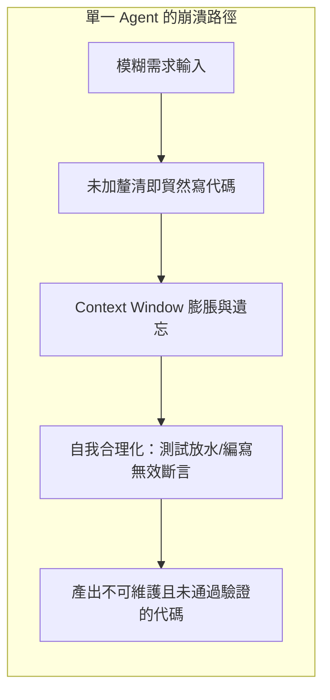
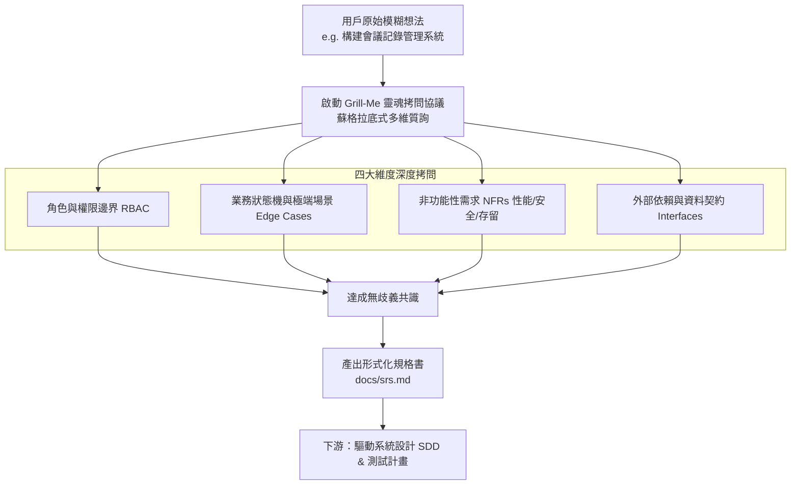
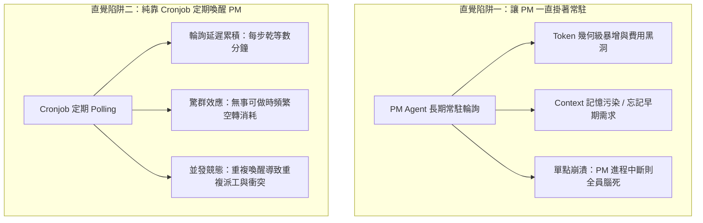
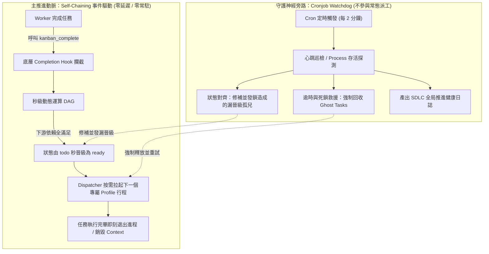
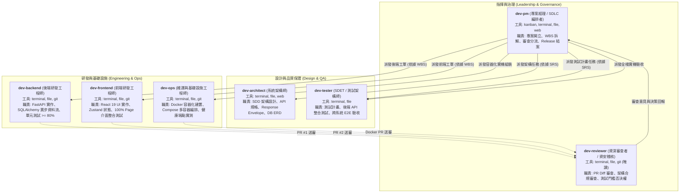
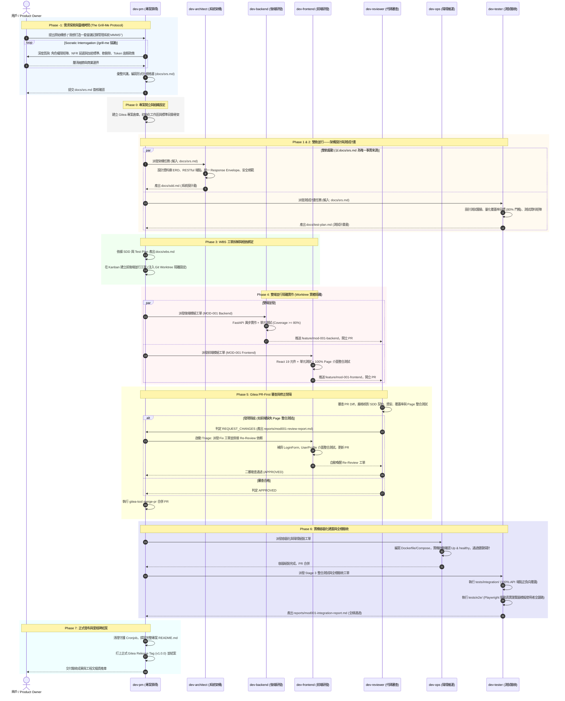

# 建立完全自主的 AI 研發團隊：基於 Hermes Agent 與 Kanban DAG 的高規格 SDLC 協同架構設計

> **架構設計與協作機制深度分享**  
> 本文系統性介紹如何基於 **Hermes Agent** 多角色輪廓（Multi-Profile）搭配 **Kanban 狀態機 (DAG)**，構建一套涵蓋「需求探索靈魂拷問 (Grill-Me)、規格形式化 (SRS)、雙軌架構與測試設計 (SDD & Test Plan)、Self-Chaining 自鏈推進、Cronjob 心跳守護、PR-First 審查迴圈、雙端量化測試治理」的全流程自主 AI 軟體工程團隊。

---

## 📑 目錄
1. [設計哲學：為何單一 Agent 無法勝任真實軟體開發？](#一設計哲學為何單一-agent-無法勝任真實軟體開發)
2. [前置探索：從模糊需求到規格形式化 (The Grill-Me Protocol & SRS)](#二前置探索從模糊需求到規格形式化-the-grill-me-protocol--srs)
   - [2.1 業餘 vs. 專業：需求模糊是專案失敗的最大元兇](#21-業餘-vs-專業需求模糊是專案失敗的最大元兇)
   - [2.2 Grill-Me 蘇格拉底式靈魂拷問機制](#22-grill-me-蘇格拉底式靈魂拷問機制)
   - [2.3 核心基石：形式化軟體需求規格書 (docs/srs.md)](#23-核心基石形式化軟體需求規格書-docssrsmd)
3. [協同核心架構：Kanban 狀態機與調度困境剖析](#三協同核心架構kanban-狀態機與調度困境剖析)
   - [3.1 Kanban 狀態機運行原理與 DAG 拓撲](#31-kanban-狀態機運行原理與-dag-拓撲)
   - [3.2 兩大直覺調度方案的致命缺陷（痛點深度拆解）](#32-兩大直覺調度方案的致命缺陷痛點深度拆解)
   - [3.3 破局之道：Self-Chaining（主推進）與 Cronjob（心跳守護）的黃金解耦](#33-破局之道self-chaining主推進與-cronjob心跳守護的黃金解耦)
4. [七大角色光譜與嚴格責任邊界 (Role Spectrum & RACI)](#四七大角色光譜與嚴格責任邊界-role-spectrum--raci)
   - [4.1 各角色職能深度拆解 (含 dev-ops)](#41-各角色職能深度拆解-含-dev-ops)
   - [4.2 團隊 RACI 責任與工具授權矩陣](#42-團隊-raci-責任與工具授權矩陣)
5. [全生命週期協同流程 (End-to-End SDLC Lifecycle & DAG)](#五全生命週期協同流程-end-to-end-sdlc-lifecycle--dag)
   - [時序全貌：從 Grill-Me 探索到 Release 發布 (Mermaid Sequence)](#時序全貌從-grill-me-探索到-release-發布-mermaid-sequence)
   - [各階段深度實作剖析 (Phase -1 ~ Phase 7)](#各階段深度實作剖析-phase--1--phase-7)
6. [前後端測試治理與責任歸屬深度拆解](#六前後端測試治理與責任歸屬深度拆解)
   - [6.1 語言與工具衝突的本質與隔離模型](#61-語言與工具衝突的本質與隔離模型)
   - [6.2 量化覆蓋率門檻與責任邊界判準](#62-量化覆蓋率門檻與責任邊界判準)
7. [產出文檔與工程交付物矩陣 (Artifacts & Deliverables)](#七產出文檔與工程交付物矩陣-artifacts--deliverables)
8. [結語：從「Prompt 工程」邁向「組織協同工程」](#八結語從-prompt-工程邁向組織協同工程)

---

## 一、設計哲學：為何單一 Agent 無法勝任真實軟體開發？

在嘗試以大語言模型（LLM）驅動軟體開發時，最直覺卻最容易失敗的反模式（Anti-pattern）是**「將所有需求直接丟給單一通用 Agent，期望它寫出整個系統」**。這種做法在面對真實工業級專案時必然遭遇以下不可逆的瓶頸：



1. **“Garbage In, Garbage Out” 需求斷層**：人類初始提出的需求往往充滿歧義與黑箱假設（如「做一個會議記錄系統」）。單一 Agent 傾向於直接猜測並開始寫扣，到了後期才發現核心邏輯、角色權限或業務邊界完全理解錯誤，重構代價極其高昂。
2. **Context Window 膨脹與記憶遺忘**：專案從需求、架構、資料庫到前後端實作，Token 消耗動輒數十萬。單一 Agent 在對話後期會開始產生嚴重幻覺，忘記早期的資料型別約定、API 契約與安全規範。
3. **缺乏制衡機制（Confirmation Bias）**：自己寫扣、自己寫測試的 Agent 會本能地降低測試難度，甚至直接在測試中撰寫假斷言（如測試陣列長度而非元件渲染），形成「測試全綠但系統全壞」的假象。
4. **缺乏專業分工與邊界**：架構師需要宏觀的抽象與契約制定；後端開發需要精確的事務控制與異步安全；前端需要細緻的狀態與 DOM 互動；SDET 需要刁鑽的負向破壞思維；DevOps 則著眼於封裝與健全探針。將所有專業混雜在一起，只會得到平庸的妥協。

---

## 二、前置探索：從模糊需求到規格形式化 (The Grill-Me Protocol & SRS)

### 2.1 業餘 vs. 專業：需求模糊是專案失敗的最大元兇

在業界軟體工程實務中，專案遭遇嚴重延宕或架構大幅重構，極大比例的根本原因往往不在於「代碼寫得不好」，而在於**「開工前根本沒把需求搞清楚」**。

* **業餘的 AI 開發**：用戶給一句話，Agent 立即回覆「沒問題，我來為你建置！」，隨後吐出一堆假設性的代碼。
* **專業的 AI 工程團隊**：在動任何一行架構與代碼前，啟動高強度的**需求探索與對齊協議（Requirement Discovery Protocol）**。



---

### 2.2 Grill-Me 蘇格拉底式靈魂拷問機制

作者引進了專門的 **`/grill-me` 協議**。此時，Agent 扮演一位「經驗豐富、言辭犀利且極度注重細節的資深產品負責人兼首席架構師（Socratic Interrogator）」，針對使用者提出的想法展開高密度的深度詰問：

#### 拷問四大維度（The 4 Pillars of Interrogation）
1. **身份與權限邊界（RBAC & Multi-Tenancy）**：
   * 「系統定義的角色（Admin, Organizer, Participant）具體職權差異為何？Participant 能否看見他人未發布的草稿？」
   * 「是否支援跨組織？登入逾期時間多久？是否需要 Refresh Token 滾動更新機制？」
2. **業務生命週期與狀態機（Lifecycle & Edge Cases）**：
   * 「會議記錄從建立、編輯、複核到歸檔的狀態流轉為何？是否允許已定稿內容修訂？修訂歷史如何保留？」
   * 「刪除會議記錄是硬刪除（Hard Delete）還是符合審計規範的軟刪除（Soft Delete）？」
3. **極端情境與防禦性規範（Edge Cases & Defensiveness）**：
   * 「若同一個帳號在兩個設備同時登入，系統行為為何？帳號被停權時，當前已發放的 JWT 是否立即作廢？」
   * 「密碼複雜度門檻、登入重試次數與防暴力破解速率限制（Rate Limiting）具體參數為何？」
4. **非功能性需求（NFRs & Compliance）**：
   * 「資料持久化保證、密碼雜湊強度（如 Bcrypt work factor $\ge 12$）、統一 API 回應格式有何具體標準？」

---

### 2.3 核心基石：形式化軟體需求規格書 (`docs/srs.md`)

只有在所有關鍵問題被徹底澄清、邊界定義完全閉環後，Agent 才會將拷問結果結構化為符合工業標準的 **`docs/srs.md`（Software Requirements Specification）**。

#### `docs/srs.md` 的關鍵要素：
* **明確編號的功能性需求（Functional Requirements）**：如 `FR-AUTH-001`（密碼註冊與雜湊強度）、`FR-USER-002`（管理員停權與角色指派）。
* **量化可測的非功能性需求（Non-Functional Requirements）**：如 `NFR-SEC-001`（密碼傳輸與存儲加密標準）、`NFR-PERF-001`（API 回應延遲 $<200\text{ms}$）。
* **驗收條件與邊界清單（Acceptance Criteria）**：每一條需求皆配對 Given-When-Then 的客觀驗收標準。

> [!IMPORTANT]
> **`docs/srs.md` 是整個團隊的最高法律（Single Source of Truth）。**  
> 後續 `dev-architect` 撰寫的架構規格（`docs/sdd.md`）必須 100% 映射 SRS；`dev-tester` 編寫的測試計畫（`docs/test-plan.md`）也必須依據 SRS 的驗收條件制定覆蓋矩陣。未寫入 SRS 的功能，一律視為無效實作。

---

## 三、協同核心架構：Kanban 狀態機與調度困境剖析

在探索多 Agent 協同的過程中，業界常落入兩種極端思維：要麼依賴 Agent 之間的自由對話（Chat-based），要麼試圖用傳統排程腳本串接。為了構建工業級穩健的研發體系，作者認為必須將「狀態管理」抽離出模型本身，建立外部的 **Kanban 狀態機**。

然而，如何驅動這座狀態機？這引發了軟體工程中最核心的調度難題。

---

### 3.1 Kanban 狀態機運行原理與 DAG 拓撲

作者採用獨立的外部 SQLite 資料庫（`kanban.db`）作為整支團隊唯一的**單一事實來源（Single Source of Truth）**，不將專案狀態寄託於 Agent 隨時可能遺忘或截斷的上下文窗口中。

```text
┌─────────────────────────────────────────────────────────────────────────────┐
│                            Kanban Task Lifecycle                            │
│                                                                             │
│   ┌────────┐   父任務皆 Done   ┌─────────┐   Dispatcher   ┌───────────┐     │
│   │  todo  │ ───────────────> │  ready  │ ─────────────> │  running  │     │
│   └────────┘                  └─────────┘   拉起 Worker   └───────────┘     │
│       ▲                            │                           │            │
│       │                            │                           │ 驗收合格   │
│       │ (Re-Review 退件回環)        │ 依賴阻塞                  ▼ 呼叫 complete
│       └────────────────────────────┼────────────────────> ┌───────────┐     │
│                                    ▼                      │   done    │     │
│                               ┌─────────┐                 └───────────┘     │
│                               │ blocked │                                   │
│                               └─────────┘                                   │
└─────────────────────────────────────────────────────────────────────────────┘
```

#### 核心運行機制
1. **嚴格的狀態流轉（Deterministic State Transitions）**：
   * `todo`：任務已建立，但其前置父依賴尚未全數達成。
   * `ready`：所有前置相依工單皆已進入 `done`，滿足執行條件，等待調度器拉起進程。
   * `running`：Worker 已被喚醒並鎖定任務（記錄 `worker_pid` 與啟動時間）。
   * `done`：Worker 呼叫 `kanban_complete()` 宣告通過驗收，觸發下游拓撲運算。
   * `blocked` / `archived`：遭遇環境硬性阻礙或已被棄用之歷史任務。
2. **有向無環圖相依約束（DAG Dependency Graph）**：
   透過 `task_links` 關聯表（`parent_id` $\rightarrow$ `child_id`）精確定義任務先後約束。一個任務可同時具備多個父任務（如代碼審查需等待後端與前端兩者皆完成 PR）。
3. **Worker 模式沙盒保護（Worker Isolation Guard）**：
   當 Worker 被喚醒時，系統自動注入環境變數 `HERMES_KANBAN_TASK=<id>`。底層工具鏈會強制將其權限降級為「唯讀與回報」——**Worker 嚴禁隨意修改其他任務的狀態或相依性**，僅允許檢視狀態與在自身工單完成時呼叫 `kanban_complete()`。

---

### 3.2 兩大直覺調度方案的致命缺陷（痛點深度拆解）

有了看板狀態機後，最大的工程挑戰在於：**「誰來負責推動工單流轉？誰來喚醒下一個 Agent？」**  
在實踐中，工程師最容易想到的兩種直覺方案，皆存在致命的架構缺陷：



#### 陷阱一：讓 PM 一直常駐掛著（Long-Running / Persistent PM Agent）會有什麼問題？
許多人構想：「不如讓 `dev-pm` 作為一個總管進程，寫個 `while True` 無限迴圈，一直掛在背景監看看板，誰做完就派下一棒。」這種設計在真實環境下會迅速崩潰：

1. **Token 消耗爆炸與費用黑洞（Token Inflation & Cost Explosion）**：
   PM 每次迴圈檢查狀態時，都必須將整個看板結構、歷史對話與工單變更重新送進 LLM 進行推論。隨著時間推移，對話長度無限膨脹，短短數小時內即可燒光數百萬 Token，營運成本呈幾何級失控。
2. **Context Window 記憶污染與嚴重幻覺（Context Saturation & Hallucination）**：
   大模型的注意力機制（Attention）極其寶貴。隨著幾十次輪詢的瑣碎日誌灌入上下文，PM 的注意力被大量雜訊稀釋，產生「記憶覆寫（Catastrophic Forgetting）」。它會開始遺忘在 Phase -1 訂下的 SRS 規格，對模組邊界產生幻覺，甚至下達前後矛盾的派工指令。
3. **單點崩潰與全盤停擺（Single Point of Failure & Process Hang）**：
   常駐的 PM 進程是脆弱的單點。一旦遭遇網路瞬斷、大模型 API Rate Limit、請求超時或未捕獲例外而終止，整支團隊的「指揮中樞」便徹底腦死。即便底下的開發者把代碼寫完了，也無人接收與推進，整個 SDLC 永久卡死。
4. **資源洩漏與伺服器負擔**：長態維持一個巨大上下文的 Python/LLM 行程，持續佔用系統記憶體與連線資源，無法做到雲原生彈性收縮。

#### 陷阱二：純粹依靠 Cronjob 檢查狀態並 Dispatch PM（Pure Cronjob Polling）會有什麼問題？
意識到「不能讓 PM 一直掛著」後，另一種直覺是：「那我寫個 Cronjob，每隔 1 分鐘或 2 分鐘跑一次。如果看到有任務完成，就喚醒 PM 一次，讓 PM 來決定下一步。」這同樣會帶來嚴重的工程硬傷：

1. **調度延遲積累與專案嚴重拖沓（Polling Latency & Cumulative Slowness）**：
   Cronjob 本質是離散的被動輪詢。若設定每 2 分鐘跑一次，當後端在第 10 秒完成時，必須乾等 1 分 50 秒才會被 Cronjob 發現並叫醒 PM；PM 派完工，前端又得等下一個週期。在一個包含多個步驟的模組閉環中，**光是等待 Cronjob 觸發的無效空窗時間就積累可觀延遲**，嚴重扼殺了自動化的效率優勢。
2. **驚群效應與無效 API 浪費（Thundering Herd & Wasted Turns）**：
   如果為了解決延遲，將 Cronjob 頻率拉高到每 5 秒或 10 秒一次，當開發者正在長時間編程（例如跑測試需要數分鐘）時，Cronjob 會瘋狂重複喚醒 PM。PM 被叫醒後「看了一眼看板發現進度沒變又關閉」，在幾分鐘內產生幾十次毫無意義的 API 呼叫與空轉開銷。
3. **並發競態與重複派工災難（Race Conditions & Duplicate Dispatching）**：
   若某個階段的 PM 被喚醒後，處理複雜依賴花費了較長時間，而下一個 Cronjob 週期又被觸發，它會判定「當前狀態仍未改變」，從而拉起第二個 PM 進程！**兩個 PM 同時運行，會並發建立兩張相同的工單、爭搶同一個 Git Branch，導致嚴重的 Worktree 衝突與資料庫死鎖！**
4. **割裂因果因應機制（Lack of Reactive Causality）**：
   輪詢模式割裂了「完成」與「推進」之間的因果鏈，使系統無法在代碼提交的黃金瞬間立即展開下一步行動。

---

### 3.3 破局之道：Self-Chaining（主推進）與 Cronjob（心跳守護）的黃金解耦

為徹底解開上述困局，作者設計了**「主動脈事件自鏈推進（Self-Chaining）」**搭配**「非同步心跳旁路守護（Cronjob Watchdog）」**的解耦架構：



#### 1. Self-Chaining 的真諦：PM 分派「下一個自己」的自鏈機制
許多人誤以為 Self-Chaining 只是單純的工作流往下跑，**但 Self-Chaining 最精妙、最核心的設計在於：`dev-pm` 在完成當前決策的當下，為「未來的自己」在 DAG 下游建立一張新的 Gatekeeper 工單（Chaining the Next Self）**！

* **分派下一個自己（Chaining the Next Self）的運作流轉**：
  1. **當前 PM 實例決策與自鏈**：在 Phase 3 拆解 WBS 時，`dev-pm` 除了派發後端與前端開發任務外，**會同時在 DAG 下游建立一張指派給「自己（assignee: dev-pm）」的工單**——《MOD-001 Review Triage Gatekeeper》，並將其相依設定為審查任務（`parents=[review_id]`）。
  2. **當前 PM 功成身退，即刻銷毀**：分派完畢後，當前的 `dev-pm` 行程立刻呼叫 `kanban_complete()` 並**徹底終止退出**！此時系統中沒有任何 PM 在記憶體中長駐，Token 與運算資源消耗歸零。
  3. **DAG 自動晉級與「新 PM」誕生**：當工程師提交 PR、Reviewer 審查完畢呼叫 `kanban_complete()` 時，看板 DAG 判定審查任務完成，那張原本沉睡的 Gatekeeper 工單瞬間晉級為 `ready`。
  4. **嶄新上下文的下一任 PM 登場**：系統秒級拉起一個全新、乾淨上下文的 `dev-pm` 行程。這個「新生的 PM」只專注於當前的審查仲裁：
     * 若發現需修正，它派發 Fix 工單給工程師，**並再次分派「下一任自己」的 Re-Review Triage 工單**；
     * 若審查合格，它**再分派「下一任自己」的 Stage 4 QA & Merge Gatekeeper 工單**！
* **工程價值**：
  **PM 不是透過死等來等待未來，而是在完成當前決策的當下，將未來的控制權封裝成一張新工單交給未來的自己。**  
  每個 PM 實例皆是短命（Ephemeral）、無狀態且專注於當下任務的，在整個專案的 DAG 里程碑上，形成了一條由多個「新生 PM」環環相扣、自主推進的「自鏈連續體」！

#### 2. Cronjob Watchdog（非同步心跳守護者）—— 專注於極端異常的容錯兜底
* **核心哲學：退居二線，不涉足常態調度，只做安全網**。
* **運作機制**：
  1. **逾時與死鎖救援（Timeout Reaper）**：若某個 Worker 因網路斷線、模型死迴圈或未捕獲崩潰而僵死，Cronjob 透過 `worker_pid` 與最後心跳時間（`last_heartbeat_at`）探測到異常，強制回收殭屍任務（Ghost Tasks）並觸發安全重試。
  2. **狀態對齊補償（Reconciliation Loop）**：當多個父工單在同一瞬間並發完成時，偶發的 SQLite 寫入競爭可能導致下游極罕見地遺漏觸發。Cronjob 定期進行拓撲掃描，主動修復孤兒工單並補償晉級。
  3. **健康巡檢日誌**：定時產出全流程的進度審計，確保系統的可觀測性。

這種解耦設計，既具備了微服務事件驅動的高效與即時，又擁有了分散式架構必備的心跳容錯防禦網！

---

## 四、七大角色光譜與嚴格責任邊界 (Role Spectrum & RACI)

在作者設計的體系中，軟體工程生命週期由 **7 位專職角色** 共同協作完成。每個角色擁有完全獨立的 `SOUL.md` 規則體系，明文規範其職權範圍與**核心鐵律（Iron Laws）**。



---

### 4.1 各角色職能深度拆解 (含 dev-ops)

#### 1. `dev-pm`（Project Manager & SDLC Orchestrator）
* **定位**：專案領導者、看板管理者與品質仲裁官。
* **核心職責**：
  * 初始化專案倉庫與基礎結構。
  * 依據架構與測試計畫產出 `docs/wbs.md`，並在 Kanban 建立關聯任務。
  * 審查退件時進行 Triage 分流，建立 Fix 任務並掛接 Re-Review。
  * 審查通過後執行 PR 合併（`gitea-tool merge-pr`）。
  * 專案最終驗收通過後，**全團隊唯一擁有權限打上正式 Gitea Release Tag（如 `v1.0.0`）並結案的角色**。
* **核心鐵律**：**絕對嚴禁親自撰寫或修改業務代碼**；專注於進度排程與驗收分流。

#### 2. `dev-architect`（System Architect）
* **定位**：技術架構制定者與 API 契約守門人。
* **核心職責**：
  * 輸入為 `docs/srs.md`，編寫系統架構設計書 [`docs/sdd.md`](file:///opt/data/workspace/mmms/docs/sdd.md)。
  * 規範系統資料模型（PostgreSQL ERD、欄位約束、索引設計）。
  * 定義 RESTful API 規格、HTTP 狀態碼、統一 Response Envelope：
    ```json
    { "success": true, "data": { ... }, "error": null, "timestamp": "..." }
    ```
  * 定義身分驗證架構（JWT Access Token 30m / Refresh Token 7d、Bcrypt work factor $\ge 12$、Email 正規化）。
* **核心鐵律**：所有端點與錯誤代碼必須嚴格對應 SRS，不得留下模糊空間；架構必須具備易測性（Testability）。

#### 3. `dev-tester`（SDET / Test Architect）
* **定位**：品質保證工程師、黑白盒測試專家。
* **核心職責**：
  * 輸入為 `docs/srs.md` 與 `docs/sdd.md`，編寫測試計畫書 [`docs/test-plan.md`](file:///opt/data/workspace/mmms/docs/test-plan.md)，訂定品質驗收標準與覆蓋矩陣。
  * Phase 6 撰寫後端 API 整合測試（`tests/integration/`），覆蓋 100% API 端點（全狀態碼與錯誤分支）。
  * Phase 6 容器啟動後，撰寫跨系統全棧 E2E 測試（`tests/e2e/`），透過 Playwright 驗證完整使用者旅程。
  * 產出 [`reports/modXXX-integration-report.md`](file:///opt/data/workspace/mmms/reports/mod001-integration-report.md)。
* **核心鐵律**：
  * **嚴禁跨入 `frontend/` 目錄撰寫任何 TypeScript/React 測試**（前端 UI 整合測試由前端開發者自負）。
  * 專注於 API 邊界、資料庫事務完整性與端到端瀏覽器驗收。

#### 4. `dev-backend`（Backend Developer）
* **定位**：後端服務與業務邏輯實作專家。
* **核心職責**：
  * 依據 SDD 規格實作 FastAPI 路由、Pydantic Schema 與 SQLAlchemy 2.0 Async 模型。
  * 撰寫後端單元測試於 `tests/unit/`。
  * 建立 `feature/mod-xxx-backend` 分支並提交 PR #1。
* **核心鐵律**：
  * **單元測試覆蓋率必須達標（$\ge 80\%$）**，否則嚴禁提交。
  * 必須完全落實 SDD 定義的 Response Envelope 與安全加密規範。

#### 5. `dev-frontend`（Frontend Developer）
* **定位**：前端架構、UI/UX 與客戶端邏輯實作專家。
* **核心職責**：
  * 依據 SDD 規格實作 React 19、TypeScript、Tailwind CSS、Zustand 狀態管理。
  * 建立雙層前端測試：
    1. 純邏輯單元測試：`frontend/src/tests/unit/`（Store, Schema, Interceptors）。
    2. Page 元件介面整合測試：`frontend/src/tests/integration/`（**覆蓋 100% 路由頁面**）。
  * 建立 `feature/mod-xxx-frontend` 分支並提交 PR #2。
* **核心鐵律**：
  * **嚴禁只測純 JavaScript 工具函式**；所有 Page 元件（`LoginForm`, `RegisterForm`, `UserProfile`, `AdminUserManager`）必須具備在 JSDOM 虛擬環境中驗證掛載渲染、表單操作與錯誤反饋的整合測試。
  * 單元測試覆蓋率同樣需達 $\ge 80\%$。

#### 6. `dev-reviewer`（Principal Code Reviewer & Security Auditor）
* **定位**：資深技術主管、資安審查員與品質否決者。
* **核心職責**：
  * 透過 Gitea PR 比對（`git diff origin/main...origin/<head_branch>`）審查代碼。
  * 查核 SDD 契約符合度、資安漏洞、異步 ORM 陷阱（如 MissingGreenlet）。
  * **雙端測試完整度否決權**：後端覆蓋率 $<80\%$ 退件；前端缺少 Page 介面整合測試退件。
  * 提交審查結論（`APPROVE` 或 `REQUEST_CHANGES`）並產出結構化審查報告。
* **核心鐵律**：**絕對嚴禁親自修改、Patch 或提交任何代碼**！所有修改要求必須以具體 Issue 條目交由 PM 退回原作者。

#### 7. `dev-ops`（DevOps & Site Reliability Engineer）
* **定位**：容器化專家、系統整合運維與環境健康保證人。
* **核心職責**：
  * 為系統撰寫高品質的 `backend/Dockerfile`、`frontend/Dockerfile` 與 `docker-compose.yml`（多階段構建、非 root 安全配置、層次緩存優化）。
  * **實機組裝啟動與健康檢查（Live Spin-up）**：在本地實測啟動所有容器服務，確認所有容器狀態為 `Up` 且 `healthy`，日誌中無未捕獲異常。
  * 透過 curl 實測健康檢查端點探針（如 `/api/v1/health`、`/nginx-health`）。
  * 提交 Docker 配置 PR 供 `dev-reviewer` 審查。
* **核心鐵律**：
  * **絕對禁止發布 Gitea Release Tag**（發布權限專屬於 PM）。
  * 容器未在實機成功運行並通過健康探針前，嚴禁提交完成。

---

### 4.2 團隊 RACI 責任與工具授權矩陣

| SDLC 任務階段 | `User / PO` | `dev-pm` | `dev-architect` | `dev-backend` | `dev-frontend` | `dev-reviewer` | `dev-ops` | `dev-tester` |
| :--- | :---: | :---: | :---: | :---: | :---: | :---: | :---: | :---: |
| **Phase -1: 需求探索 (Grill-Me)** | **A** | **R** | C | - | - | - | - | C |
| **Phase 0: 專案開立** | I | **A / R** | I | - | - | - | - | I |
| **Phase 1: SDD 設計** | I | A | **R** | I | I | C | C | C |
| **Phase 2: 測試策略** | I | A | C | I | I | C | - | **R** |
| **Phase 3: WBS 拆解** | - | **A / R** | C | I | I | - | I | I |
| **Phase 4: 後端實作** | - | A | C | **R** (單元測試) | - | - | - | - |
| **Phase 4: 前端實作** | - | A | C | - | **R** (介面整合) | - | - | - |
| **Phase 5: 代碼審查** | - | A (分流) | - | I | I | **R** (審查否決) | - | - |
| **Phase 6a: 容器建置** | - | A | - | I | I | C | **R** (實機啟動) | - |
| **Phase 6b: 整合驗收** | - | A | - | - | - | - | I | **R** (全棧測試) |
| **Phase 7: 正式發布** | **I** | **A / R** | - | I | I | I | I | I |

---

## 五、全生命週期協同流程 (End-to-End SDLC Lifecycle & DAG)

### 時序全貌：從 Grill-Me 探索到 Release 發布 (Mermaid Sequence)

以下時序圖完整展示了從**需求靈魂拷問、規格形式化、雙軌架構與測試、並行開發、審查退件自癒、實機組裝到最終發布**的全貌：



---

### 各階段深度實作剖析 (Phase -1 ~ Phase 7)

#### Phase -1: 需求探索與靈魂拷問 (The Grill-Me Protocol)
* **執行者**：`User`（提出構想） $\leftrightarrow$ `dev-pm`（主持質詢）。
* **機制**：啟動 `/grill-me` 進行高維度蘇格拉底詰問，杜絕一切模糊假設。
* **產出**：[`docs/srs.md`](file:///opt/data/workspace/mmms/docs/srs.md)（軟體需求規格書，具備編號的 FR/NFR 與驗收標準）。

#### Phase 0: 專案開立與組織設定 (Project Initialization)
* **執行者**：`dev-pm`。
* **動作**：呼叫 `gitea-tool init-project` 建立遠端私有倉庫，本地建立標準目錄樹與 `.gitignore`。
* **自動解鎖**：觸發 Phase 1（架構）與 Phase 2（測試計畫）。

#### Phase 1 & 2: 雙軌並行——系統架構與測試計畫 (Dual-Track Design)
* **執行者**：`dev-architect` 與 `dev-tester` 同步啟動。
* **產出**：
  * [`docs/sdd.md`](file:///opt/data/workspace/mmms/docs/sdd.md)：API 契約、資料庫 ERD、統一 Response Envelope `{ success, data, error, timestamp }`、JWT / Bcrypt 安全規格。
  * [`docs/test-plan.md`](file:///opt/data/workspace/mmms/docs/test-plan.md)：測試邊界劃分、覆蓋率量化目標（單元 $\ge 80\%$，端點 100%）、測試環境準備規範。

#### Phase 3: WBS 工單拆解與相依綁定 (WBS & Task Dispatching)
* **執行者**：`dev-pm`。
* **動作**：輸入 SDD 與 Test Plan，產出 [`docs/wbs.md`](file:///opt/data/workspace/mmms/docs/wbs.md)。透過 `kanban_create_task` 建立前後端並行任務，配置 `workspace_kind="git_worktree"` 實體隔離。

#### Phase 4: 雙端並行隔離實作 (Parallel Implementation)
* **執行者**：`dev-backend`（PR #1）與 `dev-frontend`（PR #2）。
* **隔離保證**：各自在 `.worktrees/<task_id>` 獨立目錄開發，互不干擾。
* **交付底線**：
  * 後端：業務邏輯 + `tests/unit/`（Pytest 覆蓋率 $\ge 80\%$）。
  * 前端：UI 元件 + `frontend/src/tests/unit/`（純邏輯）+ `frontend/src/tests/integration/`（**100% 路由頁面整合測試**）。

#### Phase 5: Gitea PR-First 審查與修正閉環 (Review & Triage Loop)
* **執行者**：`dev-reviewer` 審查，`dev-pm` 閘門分流。
* **審查標準**：SDD 契約符合度、資安漏洞（Bcrypt 工作係數、SQL 注入）、**前端 Page 元件整合測試是否存在**、**單元測試覆蓋率是否達標**。
* **閉環流轉**：
  * 若不合規：Reviewer 提交 `REQUEST_CHANGES`。PM 自動啟動 Triage 派發 Fix 任務並建立 Re-Review 依賴，直至二審通過。
  * 若合規：Reviewer 提交 `APPROVE`，PM 執行 `gitea-tool merge-pr` 合併至 `main`。

#### Phase 6: 實機容器化建置與全棧驗收 (Live Assembly & Verification)
* **執行者**：`dev-ops`（容器化與健康保證） $\rightarrow$ `dev-tester`（全棧驗收）。
* **交付物**：
  * `dev-ops`：撰寫 `Dockerfile` 與 `docker-compose.yml`，在本地實機執行 `docker compose up --build -d`，確認所有容器狀態為 `Up` 且 `healthy`，通過健康端點探針。
  * `dev-tester`：撰寫 `tests/integration/`（100% 後端 API 端點驗證）與 `tests/e2e/`（Playwright 跨瀏覽器端到端測試），產出 [`reports/modXXX-integration-report.md`](file:///opt/data/workspace/mmms/reports/mod001-integration-report.md)。

#### Phase 7: 正式發布與里程碑結案 (Release & Sign-Off)
* **執行者**：`dev-pm` 專屬執行。
* **動作**：停止守護 Cronjob、撰寫正式專案 `README.md`，打上正式 Gitea Release Tag（如 `v1.0.0`），關閉里程碑並向用戶交付。

---

## 六、前後端測試治理與責任歸屬深度拆解

在多語言全端專案中，「測試工具衝突」與「測試責任推諉」是造成專案失控的核心癥結。作者透過**物理目錄嚴格分層**與**純量化覆蓋率指標**，確立了牢不可破的治理模型。

### 6.1 語言與工具衝突的本質與隔離模型

* **後端工具棧**：Python 3.11+, Pytest, pytest-cov, HTTPX, FastAPI TestClient。
* **前端工具棧**：TypeScript, Vitest, @testing-library/react, jsdom。
* **端到端工具棧**：Playwright (跨瀏覽器端到端驅動)。

若目錄未妥善隔離，Pytest 掃描時會誤觸 `frontend/node_modules` 導致崩潰；前端執行器也會因路徑混淆找不到測試夾具。

```text
專案根目錄/
├── backend/                                ─── 後端源碼 (Python)
├── frontend/                               ─── 前端源碼 (TypeScript / React)
│   └── src/
│       └── tests/
│           ├── unit/                       ─── 【前端單元測試】(Store, Zod, Client)
│           │   ├── authStore.test.ts
│           │   └── validation.test.ts
│           └── integration/                ─── 【前端 Page 介面整合測試】(100% 路由)
│               ├── LoginForm.test.tsx
│               └── UserProfile.test.tsx
├── tests/
│   ├── conftest.py
│   ├── unit/                               ─── 【後端單元測試】(Pytest, 覆蓋率 >= 80%)
│   │   ├── test_auth_service.py
│   │   └── test_user_service.py
│   ├── integration/                        ─── 【後端 API 整合測試】(100% 端點覆蓋)
│   │   └── test_api_auth.py
│   └── e2e/                                ─── 【跨系統全棧 E2E 測試】(Playwright)
│       └── test_user_journey.py
```

---

### 6.2 量化覆蓋率門檻與責任邊界判準

作者徹底揚棄「用測試目錄主觀猜測責任」的反模式，改用**純量化覆蓋率公式**判定責任歸屬：

$$\text{Unit Gate} = \begin{cases} \text{Pass}, & \text{Coverage}_{\text{unit}} \ge 80\% \\ \text{Reject (退件修復)}, & \text{Coverage}_{\text{unit}} < 80\% \end{cases}$$

$$\text{Surface Gate} = \begin{cases} \text{Pass}, & \text{Coverage}_{\text{endpoint}} = 100\% \land \text{Coverage}_{\text{route}} = 100\% \\ \text{Reject (退件修復)}, & \text{其他} \end{cases}$$

#### 測試維度與責任歸屬清單

| 測試類型 | 實體目錄 | 負責角色 | 核心測試對象與範疇 | 驗收標準 (Quality Gate) |
| :--- | :--- | :--- | :--- | :--- |
| **後端單元測試** | `tests/unit/` | `dev-backend` | 業務服務邏輯、密碼雜湊、Token 產生、Schema 驗證 | 單元覆蓋率 **$\ge 80\%$**；未達標 Reviewer 直接退件 |
| **後端 API 整合測試** | `tests/integration/`| `dev-tester` | FastAPI 端點、SQLAlchemy 資料庫交易回滾、狀態碼與 Envelope 驗證 | 後端 API 端點 **100% 覆蓋**（包含所有錯誤狀態碼分支） |
| **前端單元測試** | `frontend/src/tests/unit/` | `dev-frontend` | Zustand Store 狀態變更、Zod Schema 欄位驗證、API Client 攔截器 | 純邏輯覆蓋率 **$\ge 80\%$** |
| **前端 Page 整合測試** | `frontend/src/tests/integration/`| `dev-frontend` | 在 JSDOM 中 Mount `LoginForm`、`RegisterForm`、`UserProfile`，模擬點擊、輸入與錯誤反饋 | 路由頁面 **100% 覆蓋**；缺任一頁面整合測試直接退件 |
| **全棧 E2E 驗收測試** | `tests/e2e/` | `dev-tester` | 當 `dev-ops` 啟動所有容器後，以 Playwright 驅動真實瀏覽器模擬使用者全鏈路操作 | 核心 User Journey 100% 通過 |

---

## 七、產出文檔與工程交付物矩陣 (Artifacts & Deliverables)

在整個專案的演進過程中，每位 Agent 都會沉澱高品質的結構化文檔，確保軟體資產具備 100% 的可審計性（Auditability）：

| 交付檔案路徑 | 負責角色 | 產出階段 | 核心內容與工程價值 |
| :--- | :--- | :--- | :--- |
| [`docs/srs.md`](file:///opt/data/workspace/mmms/docs/srs.md) | `dev-pm` / User | Phase -1 | 軟體需求規格書、Grill-Me 靈魂拷問結果、FR/NFR 編號清單與驗收條件 |
| [`docs/sdd.md`](file:///opt/data/workspace/mmms/docs/sdd.md) | `dev-architect` | Phase 1 | 系統架構圖、PostgreSQL 資料庫設計、RESTful API 端點與統一 Envelope 規格、安全協議 |
| [`docs/test-plan.md`](file:///opt/data/workspace/mmms/docs/test-plan.md) | `dev-tester` | Phase 2 | 測試邊界矩陣、量化覆蓋率目標（80% 門檻）、測試資料策略與驗收環境規格 |
| [`docs/wbs.md`](file:///opt/data/workspace/mmms/docs/wbs.md) | `dev-pm` | Phase 3 | 工作分解結構清單、模組相依圖、Task ID 與 Kanban 工單映射矩陣 |
| `reports/modXXX-review-report.md` | `dev-reviewer` | Phase 5 | PR Diff 審查清單、架構合規性、資安漏洞稽核、雙端測試覆蓋率檢查結果 |
| `reports/modXXX-re-review-report.md` | `dev-reviewer` | Phase 5 (Re) | 針對修正 Commit 的複查記錄，逐項核銷 Review Issue 清單 |
| `docker-compose.yml` & `Dockerfile` | `dev-ops` | Phase 6a | 多階段構建設定檔、非 root 安全配置、容器健康檢查探針宣告 |
| `reports/modXXX-integration-report.md`| `dev-tester` | Phase 6b | 全量 API 整合測試報表、端點覆蓋矩陣、Playwright E2E 執行紀錄與日誌截圖 |
| **Gitea Release Tag (v1.0.0)** | `dev-pm` | Phase 7 | 正式發布標籤、發布說明（Release Notes）、交付驗收簽核紀錄 |

---

## 八、結語：從「Prompt 工程」邁向「組織協同工程」

這套基於 **Hermes Agent** 與 **Kanban DAG** 的多智能體架構，體現了一個根本性的思維轉變：

> **打造可靠的 AI 軟體團隊，關鍵從來不在於「寫出多神奇的單一 Prompt」，而在於「構建一套具備物理防護、規格形式化、狀態持久化、職權制衡與自我修復閉環的工程體系」。**

透過：
1. **前置 Grill-Me 協議** 將模糊想法在動工前形式化為清晰無歧義的 `docs/srs.md`；
2. **外部 SQLite Kanban** 終結記憶遺忘，以 DAG 驅動自動化依賴晉級；
3. **Self-Chaining** 讓整個團隊告別人工作陪，實現流水線無縫自驅運轉；
4. **Cronjob Watchdog** 提供即時心跳監控與死鎖逾時救援；
5. **七大角色 RACI 矩陣**（精確劃定 `dev-ops` 實機健康驗證與 `dev-reviewer` 不妥協審查）；
6. **PR-First 機制** 實現真實的代碼審查與瑕疵修正迴圈；
7. **客觀指標測試治理** 徹底理清前後端語言與責任邊界；

AI 代理人不再只是「偶爾給出程式碼片段的助手」，而是真正演化為一支紀律嚴明、分工明確、具備工業級工程可靠度的**自主軟體研發團隊**。
